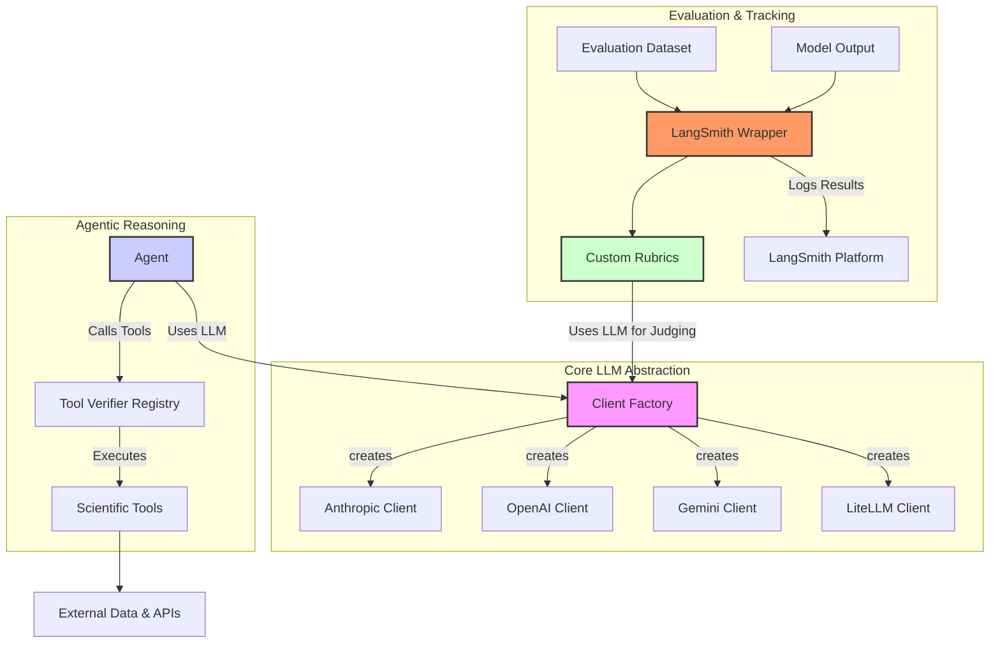

# System Architecture & Overview

## Project Goals

Hooke Explain is a framework dedicated to enhancing the reliability and transparency of scientific explanations generated by Large Language Models (LLMs). Our primary goal is to move beyond simple text generation and create a system that can **reason**, **verify its claims**, and **evaluate its own performance** against rigorous scientific criteria.

We aim to:
1.  **Generate Verifiable Explanations**: Produce scientific claims that are not just plausible but can be actively verified through external tools and data sources.
2.  **Automate Evaluation**: Develop a robust, automated evaluation framework to score LLM-generated explanations for correctness, plausibility, and resistance to falsification.
3.  **Standardize LLM Interaction**: Create a unified interface for interacting with multiple LLM providers, making it easy to swap backends and compare performance.
4.  **Integrate with Industry-Standard Tooling**: Ensure that our evaluation results are compatible with platforms like LangSmith for comprehensive tracking and analysis.

## Architectural Design

The codebase is organized into three main pillars, each designed to handle a distinct aspect of the explanation and evaluation workflow. This modular design allows for independent development and testing of each component.

### 1. Unified LLM Clients (`src/explain/llm`)

-   **What it is**: A centralized client for interacting with various LLM providers (Anthropic, OpenAI, Gemini, LiteLLM).
-   **Why it exists**: Different LLM providers have unique APIs, especially for advanced features like tool calling. This module abstracts away those differences, providing a single, consistent interface (`create_llm_client`). This allows developers to focus on application logic without worrying about provider-specific implementation details and makes it trivial to benchmark different models.

### 2. Evaluation Framework (`src/explain/eval`)

-   **What it is**: A suite of tools for assessing the quality of LLM-generated explanations. It includes:
    -   **Rubrics**: Define the criteria for evaluation, such as `PlausibilityRubric`, `CorrectnessRubric`, and `FalsificationRubric`. These rubrics use LLMs as judges to score responses.
    -   **LangSmith Wrapper**: A bridge that connects our custom rubrics to the LangSmith platform, allowing for standardized tracking of evaluation results.
    -   **Tools**: A collection of verifiable, agentic tools (e.g., `DTIVerifier`) that can be used by an LLM to query external data sources and APIs to verify claims.
-   **Why it exists**: Simply asking an LLM for an explanation is not enough. We need a systematic way to measure the quality of those explanations. This framework provides the tools to do so in an automated and reproducible manner, which is critical for building trust in the system.

### System Diagram

The following diagram illustrates how these components interact.

## Future Goals

While the current framework provides a strong foundation, we have several key areas we plan to improve:

-   **Expansion of the Tool Library**: We will continue to add more scientific tools to our library, covering a broader range of biological and chemical data sources.
-   **Advanced Agentic Workflows**: We plan to develop more sophisticated agents that can perform multi-step reasoning and autonomously chain tool calls to answer complex questions.
-   **Improved Evaluation Metrics**: We will refine our rubrics and develop new ones to capture more nuanced aspects of scientific explanations, such as citation quality and the ability to synthesize information from multiple sources.
-   **Tighter Integration with `cb-reach`**: We will work to create a more seamless integration with the `cb-reach` submodule, allowing for more powerful and flexible interactions with the enhanced-chat service.

By pursuing these goals, we aim to make Hooke Explain a state-of-the-art framework for generating and evaluating trustworthy scientific explanations. 