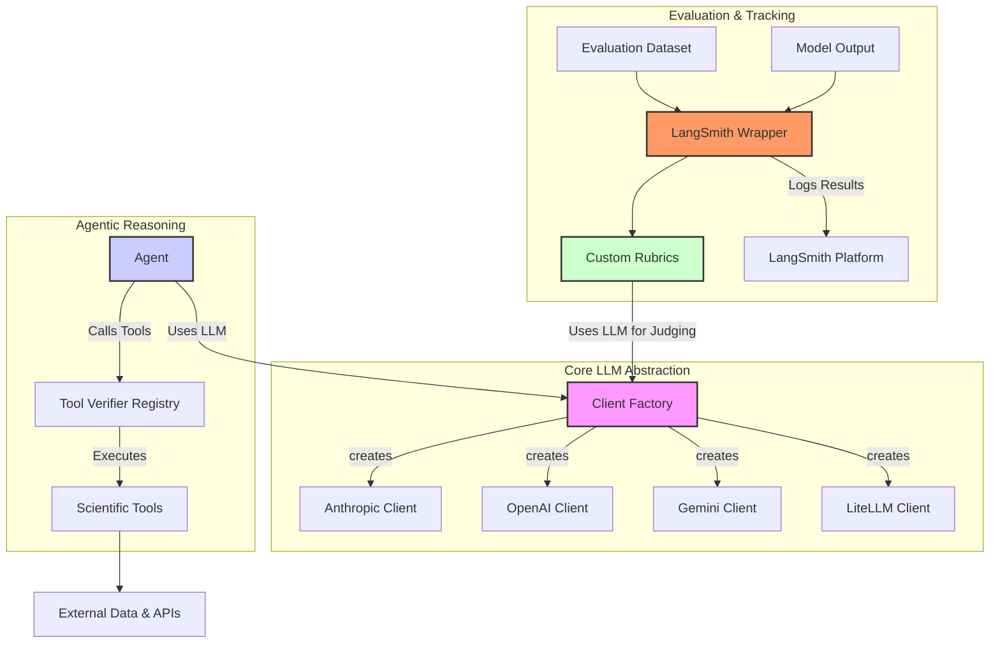

# Overview & System Architecture

## Project Goals

Hooke Explain is a framework for generating and verifying biological hypotheses using LLM-callable tools, designed for both evaluation and multi-turn reinforcement learning (RL) training.
This system enables Large Language Models (LLMs) to systematically verify biological hypotheses through:

- **Verification tools** with detailed standardized JSON outputs (including the `reward`  and `feedback`  keys), and pydantic model schema
- **Multi-turn RL environment** compatible with GRPO finetuning using the `verifiers` framework
- **LangChain integration** with LangSmith observability for evaluation monitoring
- **Multi-provider LLM support**: support for Anthropic, Gemini, and OpenAI

## Architectural Design

The codebase is organized into three main pillars, each designed to handle a distinct aspect of the explanation and evaluation workflow. This modular design allows for independent development and testing of each component.

### 1. Unified LLM Clients (`src/explain/llm`)

-   **What it is**: A centralized client for interacting with various LLM providers (Anthropic, OpenAI, Gemini, LiteLLM).
-   **Why it exists**: Different LLM providers have unique APIs, especially for advanced features like tool calling. This module abstracts away those differences, providing a single, consistent interface (`create_client`). This allows developers to focus on application logic without worrying about provider-specific implementation details and makes it trivial to benchmark different models.

### 2. Evaluation Framework (`src/explain/eval`)

-   **What it is**: A suite of tools for assessing the quality of LLM-generated explanations. It includes:
    -   **Rubrics**: Define the criteria for evaluation, such as `PlausibilityRubric`, `CorrectnessRubric`, and `FalsificationRubric`. These rubrics can use LLMs as judges to score responses.
    -   **LangSmith Wrapper**: A bridge that connects the rubrics to the LangSmith platform, allowing for standardized tracking of evaluation results.
    -   **Tools**: A collection of verifiable, agentic tools (e.g., `DTIVerifier`) that can be used by an LLM to query external data sources and APIs to verify claims.
-   **Why it exists**: Simply asking an LLM for an explanation is not enough. We need a systematic way to measure the quality of those explanations. This framework provides the tools to do so in an automated and reproducible manner, which is critical for building trust in the system.

### System Diagram

The following diagram illustrates how these components interact.

